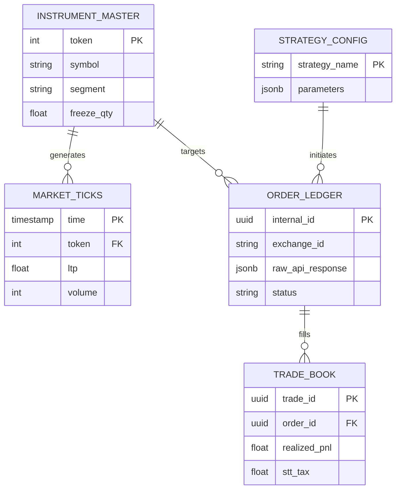

# Database Schema & Engineering

**Engine:** PostgreSQL 17+

**Driver:** `asyncpg` (via SQLAlchemy Async)

**Extensions:** `timescaledb` (Optional), `pg_trgm`, `uuid-ossp`

## 1. Design Philosophy

The NeoPulse database is designed with three distinct distinct workloads in mind:

1. **High-Velocity Ingestion:** `market_ticks` table must handle 500+ writes/second without locking.
2. **Immutable Audit Trail:** `order_ledger` must never be updated in place; it tracks the lifecycle of orders.
3. **JSONB Flexibility:** We use PostgreSQL's `JSONB` to store raw API responses from Kotak, ensuring we can debug "Freak Trade" rejections without schema migrations.

---

## 2. ER Diagrammermaid



---

## 3. Schema Definitions

### 3.1 Master Data (`instrument_master`)
Stores static contract details. Updated daily via the "Morning Drill".

```sql
CREATE TABLE instrument_master (
    instrument_token INTEGER PRIMARY KEY,   -- Kotak Token ID
    exchange_token   VARCHAR(20),           -- NSE Token
    trading_symbol   VARCHAR(50) NOT NULL,  -- e.g., "NIFTY26JANFUT"
    name             VARCHAR(100),          -- e.g., "NIFTY 50"
    lot_size         INTEGER DEFAULT 1,
    tick_size        DECIMAL(10, 2) DEFAULT 0.05,
    freeze_qty       INTEGER,               -- Critical for Iceberg Slicing
    segment          VARCHAR(10) CHECK (segment IN ('NSE_CM', 'NSE_FO')),
    updated_at       TIMESTAMP DEFAULT NOW()
);

-- Index for fast symbol lookup during signal generation
CREATE INDEX idx_instr_symbol ON instrument_master(trading_symbol);

```

### 3.2 Market Data (`market_ticks`)

**Strategy:** Declarative Partitioning.
We partition this table by **Day**. This allows us to drop old data instantly (`DROP TABLE market_ticks_y2025m01d20`) without expensive `DELETE` operations that bloat the WAL.

```sql
CREATE TABLE market_ticks (
    tick_time   TIMESTAMP WITH TIME ZONE NOT NULL,
    token       INTEGER NOT NULL,
    ltp         DECIMAL(10, 2),
    volume      BIGINT,
    bid_price   DECIMAL(10, 2),
    ask_price   DECIMAL(10, 2),
    oi          BIGINT -- Open Interest
) PARTITION BY RANGE (tick_time);

-- Example Partition Creation (Automated by Python Script)
CREATE TABLE market_ticks_2026_01_20 PARTITION OF market_ticks
    FOR VALUES FROM ('2026-01-20 00:00:00') TO ('2026-01-20 23:59:59');

-- BRIN Index is 90% smaller than B-Tree and perfect for time-series
CREATE INDEX idx_ticks_time_brin ON market_ticks USING BRIN(tick_time);

```

### 3.3 Transaction Ledger (`order_ledger`)

The core of the Order Management System (OMS). This table uses `JSONB` to store the exact response received from Kotak Neo, acting as a forensic evidence locker.

```sql
CREATE EXTENSION IF NOT EXISTS "uuid-ossp";

CREATE TABLE order_ledger (
    internal_id     UUID PRIMARY KEY DEFAULT uuid_generate_v4(),
    parent_order_id UUID,                     -- For Iceberg "Parent" tracking
    exchange_id     VARCHAR(50),              -- Nullable until confirmed by Exchange
    
    -- Order Details
    token           INTEGER REFERENCES instrument_master(instrument_token),
    transaction_type VARCHAR(4) CHECK (transaction_type IN ('BUY', 'SELL')),
    order_type      VARCHAR(10) CHECK (order_type IN ('L', 'MKT', 'SL', 'SL-M')),
    product         VARCHAR(10) DEFAULT 'MIS', -- MIS (Intraday) or CNC (Delivery)
    
    quantity        INTEGER NOT NULL,
    price           DECIMAL(10, 2),
    trigger_price   DECIMAL(10, 2),
    
    -- State Management
    status          VARCHAR(20) NOT NULL DEFAULT 'PENDING_LOCAL',
    rejection_reason TEXT,
    
    -- Audit & Strategy
    strategy_id     VARCHAR(50),              -- e.g., "MOMENTUM_V1"
    created_at      TIMESTAMP DEFAULT NOW(),
    updated_at      TIMESTAMP DEFAULT NOW(),
    
    -- The Black Box
    raw_request     JSONB,                    -- What we sent
    raw_response    JSONB                     -- What Kotak sent back
);

CREATE INDEX idx_ledger_status ON order_ledger(status);
CREATE INDEX idx_ledger_exchange_id ON order_ledger(exchange_id);

```

### 3.4 Trade Book & PnL (`trade_book`)

Records *filled* trades only. Used for PnL calculation.

```sql
CREATE TABLE trade_book (
    trade_id        UUID PRIMARY KEY DEFAULT uuid_generate_v4(),
    order_id        UUID REFERENCES order_ledger(internal_id),
    
    fill_price      DECIMAL(10, 2) NOT NULL,
    fill_qty        INTEGER NOT NULL,
    fill_time       TIMESTAMP DEFAULT NOW(),
    
    -- Cost Analysis
    commission      DECIMAL(10, 2) DEFAULT 0.0, -- Usually 0 for Kotak Intraday
    tax_stt         DECIMAL(10, 2),             -- Calculated: 0.025% (Sell)
    tax_txn         DECIMAL(10, 2),             -- NSE Charges
    
    net_realized_pnl DECIMAL(10, 2)             -- Null for Open positions
);

```

---

## 4. Performance Tuning

### 4.1 PostgreSQL Config (`postgresql.conf`)

Optimized for a system with 4GB RAM (e.g., Oracle Cloud Ampere).

```ini
# Memory
shared_buffers = 1GB
work_mem = 16MB             # Per connection (careful with high connections)
maintenance_work_mem = 256MB

# Checkpoints (Reduce IO spikes)
min_wal_size = 1GB
max_wal_size = 4GB
checkpoint_completion_target = 0.9

# Parallel Query
max_worker_processes = 4
max_parallel_workers_per_gather = 2

```

### 4.2 Connection Pooling

The FastAPI application MUST use `SQLAlchemy` with a pool size limit to prevent overwhelming the DB with connections.

* **Pool Size:** 20
* **Max Overflow:** 10
* **Pool Timeout:** 30s

---

## 5. Maintenance & Retention

### 5.1 Partition Management

A Python background task (part of "Morning Drill") executes daily at 00:05 AM:

1. **Create:** Partition for `Tomorrow`.
2. **Drop:** Partitions older than `30 days` (for tick data).
* *Note:* `order_ledger` and `trade_book` are **never** dropped, only archived to CSV/S3 after 1 year.


### 5.2 Backup Strategy

See `docs/operations/setup.md` for the `pg_dump` cron job details.
