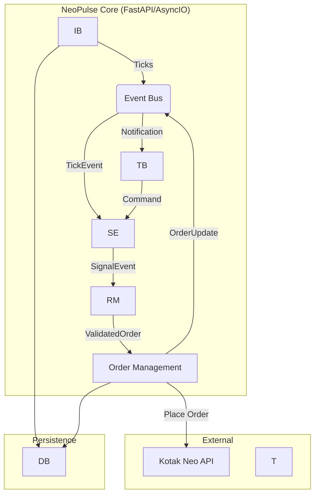

# System Architecture & Design

## 1. High-Level Architecture
NeoPulse_api follows a **Modular Monolith** pattern driven by an asynchronous Event Bus. This ensures that market data ingestion (IO-bound) does not block strategy execution (CPU-bound).

### Architecture Diagrammermaid

## 2. Core Components

### 2.1 The Event Bus
The central nervous system. It decouples the WebSocket consumer from the Strategy execution.
*   **Implementation:** `asyncio.Queue`
*   **Flow:** `MarketData` -> `Queue` -> `StrategyWorker`

### 2.2 Virtual Broker (Proxy Pattern)
Designed to allow "Live Simulation". The `VirtualBroker` class wraps the real `NeoAPI` client to simulate trading without risking capital.
*   **Read Operations:** Passthrough to real API (e.g., `quote()`, `positions()`).
*   **Write Operations:** Intercepted.
    *   `place_order()`: Generates a fake Order ID and stores it in memory.
    *   `process_candle()`: Checked every minute. If `Low < Buy_Limit`, the order is marked `FILLED`.

### 2.3 Database Schema (PostgreSQL)

**Table: `instrument_master`**
*   `instrument_token` (PK): Unique ID from Kotak.
*   `symbol`: Trading symbol (e.g., RELIANCE-EQ).
*   `tick_size`: Minimum price movement.

**Table: `market_ticks` (Partitioned)**
*   `timestamp` (PK, Time): UTC timestamp.
*   `token`: FK to instrument_master.
*   `ltp`: Last Traded Price.
*   `volume`: Volume traded.
*   *Partitioning:* By Day (e.g., `market_ticks_2026_01_20`).

**Table: `order_ledger`**
*   `internal_id` (UUID): System generated ID.
*   `exchange_id`: ID returned by Kotak.
*   `strategy_tag`: e.g., "MOMENTUM_RSI".
*   `status`: OPEN, TRADED, REJECTED, CANCELLED.
*   `metadata`: JSONB column storing the full API response for auditing.

## 3. Deployment Architecture

*   **Containerization:** Docker.
*   **Orchestration:** Docker Compose (Service 1: App, Service 2: DB).
*   **Cloud:** Oracle Cloud (Ampere/ARM) or AWS Mumbai (ap-south-1).
*   **Networking:** Private subnet for DB; Host network for App to minimize latency.
