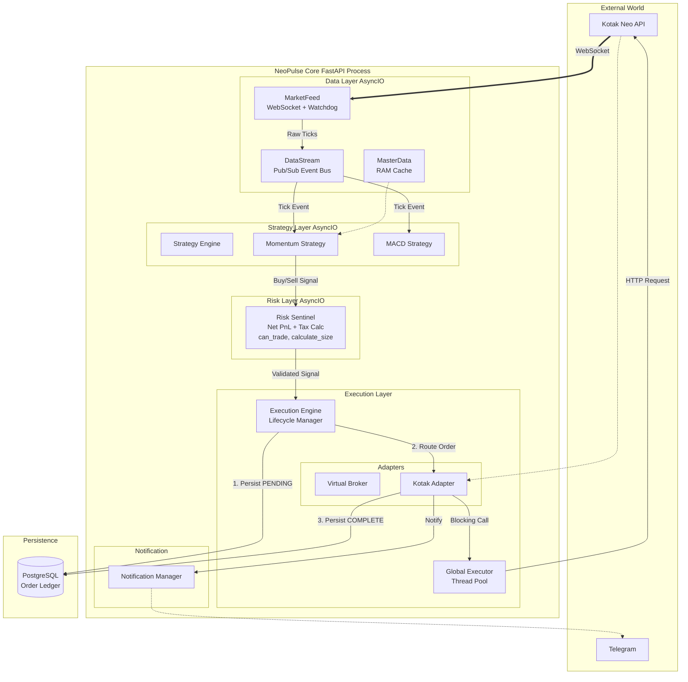

# System Architecture & Design

## 1. High-Level Architecture

NeoPulse follows a **Reactive Modular Monolith** pattern. The system is event-driven but runs within a single process to minimize network latency (serialization/deserialization costs).

The architecture is strictly divided into **AsyncIO** (Non-Blocking) and **Threaded** (Blocking) domains to ensure that a slow broker API response never freezes the market data feed.

### Architecture Diagram

## 2. Component Deep Dive

### A. The Data Layer (Nervous System)

* **MarketFeed:** A self-healing WebSocket client. It includes a **"Zombie Watchdog"** that strictly monitors the time since the last packet. If silence > 10s, it forcibly kills the connection and triggers a reconnect with exponential backoff.
* **DataStream:** An in-memory `asyncio.Queue` based Event Bus. Strategies subscribe to specific tokens (`2885`) to receive ticks.
* **MasterDataManager:** Loads the entire Instrument Master (10k+ rows) into a Python Dictionary at startup for complexity symbol lookups (`RELIANCE-EQ` -> `2885`).

### B. The Execution Layer (Arms)

* **ExecutionEngine:** The central coordinator. It ensures **Atomicity**:
1. Create `OrderLedger` entry (Status: `PENDING_BROKER`).
2. Send Order to Adapter.
3. Update `OrderLedger` (Status: `COMPLETE` or `REJECTED`).

* *Why?* If the app crashes between step 2 and 3, the DB still has a record of the attempt, preventing "Ghost Orders".

* **GlobalExecutor:** A `ThreadPoolExecutor` (default 20 workers). It wraps all blocking Kotak SDK calls (`place_order`, `login`) so they run in a separate thread, preventing the main AsyncIO loop from lagging.

### C. The Risk Layer (Shield)

* **RiskSentinel:** A proactive guardrail.
* **Net PnL Calculation:**

$$\text{Net PnL} = \text{Gross PnL} - (\text{Turnover} \times 0.00035)$$

* *Note:* The 0.035% tax estimation covers STT, Exchange Txn Charges, Stamp Duty, SEBI Fee and GST.

* **Kill Switch:** If `Net PnL < Max Daily Loss`, the Sentinel locks the engine, rejecting all new `BUY` orders immediately.

## 3. Database Schema

**Table: `order_ledger**`
| Column | Type | Description |
| :--- | :--- | :--- |
| `internal_id` | UUID | Primary Key (System generated) |
| `exchange_id` | String | Kotak Order ID (e.g., `124012800005`) |
| `token` | Integer | Instrument Token |
| `transaction_type`| String | BUY / SELL |
| `status` | String | PENDING, COMPLETE, REJECTED, CANCELLED |
| `raw_response` | JSONB | Full API response dump for auditing |

**Table: `instrument_master**`

* Synced daily via `scripts/sync_master.py`.
* Contains `lot_size`, `tick_size`, and `freeze_qty` critical for validation.

## 4. Deployment Strategy

* **Container:** Docker (Python 3.11 Slim).
* **Orchestration:** Docker Compose.
* **Restart Policy:** `unless-stopped` (Ensures the bot revives after a crash).
